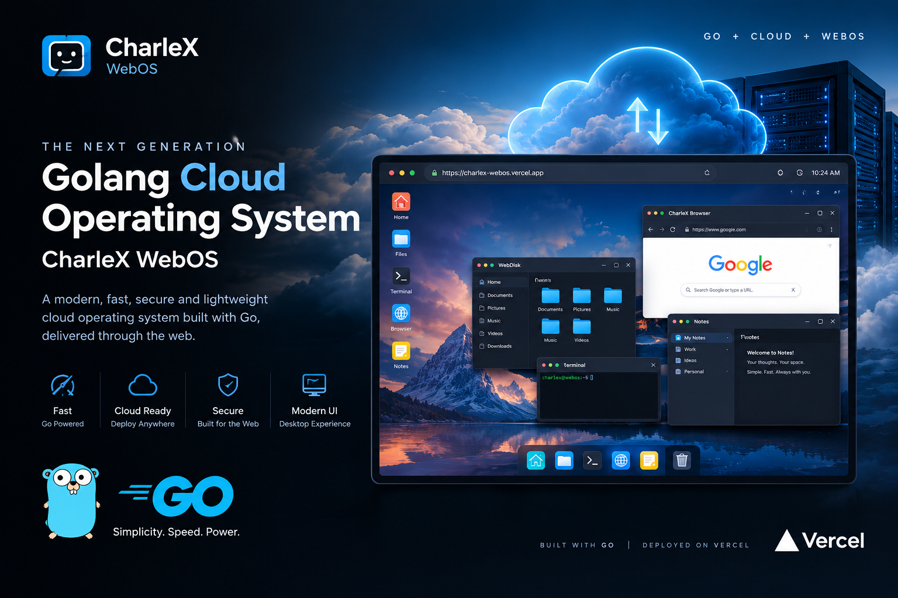

# CharleX WebOS



## Golang Cloud Operating System

**CharleX WebOS** is a browser-based desktop environment built around a simple idea:
bring the structure and usability of a desktop operating system to the web while
keeping the core application lightweight, portable, and powered by **Golang**.

CharleX WebOS is best understood as a **Golang Cloud Operating System**: a web
workspace where the Go application renders the desktop shell, serves the application
resources, and provides the runtime foundation while the browser handles the
interactive desktop experience.

```text
                   CharleX WebOS
            Golang Cloud Operating System
                         │
             ┌───────────┴───────────┐
             │       Golang Core     │
             │                       │
             │  HTTP • Templates     │
             │  Embedded Assets      │
             │  Application Runtime  │
             └───────────┬───────────┘
                         │
             ┌───────────┴───────────┐
             │     WebOS Desktop     │
             │                       │
             │  Windows • Dock       │
             │  Browser • Notes      │
             │  WebDisk • Terminal   │
             │  System Information   │
             └───────────────────────┘
```

---

## Project Vision

Traditional operating systems give users a desktop, windows, applications, storage,
and system tools. CharleX WebOS brings the same *interaction model* into a browser.

The goal is not to imitate an entire physical operating system. The goal is to make
the web feel like a personal computing environment:

- one desktop workspace
- application windows instead of page redirects
- familiar close, minimize, maximize, restore, and drag interactions
- cloud-oriented access from a browser
- a small Go-powered application core
- front-end modules that remain easy to understand and modify

The entire experience is centered on staying inside the WebOS desktop.

---

## Why Golang?

Golang is the core implementation language for CharleX WebOS because it provides a
small and direct server-side foundation without requiring a large application stack.

The Go layer is responsible for:

- serving the WebOS application
- rendering the main HTML template
- embedding and serving static resources
- providing a portable executable
- keeping the server architecture understandable

The browser layer is responsible for interactive behavior such as window movement,
window state, keyboard input, fullscreen behavior, browser embedding, and application
interfaces.

This creates a clean division:

```text
Golang
  ├── HTTP server
  ├── HTML rendering
  ├── Embedded filesystem
  └── Application entry point

Browser
  ├── Window manager
  ├── Dock
  ├── CharleX Browser
  ├── WebDisk
  ├── Notes
  ├── Terminal
  └── System information
```

---

## The WebOS Desktop

CharleX WebOS uses a window-based desktop model instead of moving the user between
separate application pages.

Every application lives in a desktop window. The desktop remains the main workspace,
and application actions happen without unnecessary page redirects.

### Window Controls

Each WebOS window supports:

- **Close** — removes the window from the visible desktop.
- **Minimize** — hides the window while keeping its application state available.
- **Maximize** — expands the window across the desktop.
- **Restore** — returns a maximized window to its previous position and dimensions.
- **Double-click title bar** — toggles maximize/restore.
- **Drag** — moves a normal window around the desktop.
- **Focus** — brings the selected window to the foreground.

The control layer is designed to work for both server-rendered windows and windows
created dynamically by JavaScript.

The window controls deliberately have a direct action path as well as the central
window-manager path. This keeps the desktop resilient if scripts are loaded in a
different order or if a browser aggressively caches an older JavaScript resource.

---

## CharleX Browser

The **CharleX Browser** is an application window inside the WebOS desktop.

It provides:

- URL input
- automatic `https://` normalization
- navigation with the **Go** button
- Enter-key navigation
- embedded page rendering through an iframe
- loading and status feedback
- external opening for websites that intentionally block iframe embedding

A web page can refuse to appear inside another page because of browser security
policies. CharleX does not try to bypass those policies. Instead, the Browser offers
an external-open action for those sites.

The Browser remains an application inside CharleX WebOS rather than redirecting the
whole desktop to another URL.

---

## WebDisk

**WebDisk** is the file-management workspace of CharleX WebOS.

Its interface follows a familiar desktop file manager model with:

- directory navigation
- file creation
- folder creation
- rename operations
- delete operations
- current-path display
- asynchronous loading feedback
- desktop-style file listing

The UI is intentionally designed as an application window so the rest of the WebOS
desktop remains available while the user works with files.

---

## Notes

The **Notes** application provides a lightweight writing environment inside the
WebOS desktop.

Features include:

- editable note content
- configurable note filename
- encrypted save workflow
- local browser-side storage behavior
- downloading note data
- loading encrypted note files
- status feedback

Saving a note is an application operation and does not require navigating away from
the WebOS desktop.

---

## Terminal

The **Terminal** application provides a terminal-style interface for WebOS commands
and demonstrations.

It is intentionally a browser application surface. It should be understood as a
WebOS terminal interface rather than unrestricted access to the operating system on
the host machine.

---

## System Information

The **System Information** window provides runtime and browser information directly
inside the WebOS desktop.

This keeps diagnostics in the same application environment instead of requiring a
separate page.

---

## Architecture

The project is intentionally divided into a small Go core and focused front-end
modules.

```text
charlex-web-os-go/
│
├── main.go
│
├── api/
│   └── index.go
│
├── app/
│   ├── app.go
│   └── static/
│       ├── css/
│       ├── img/
│       └── js/
│
├── docs/
│   └── charlex-webos-cover.png
│
└── README.md
```

### Go layer

`app/app.go` contains the WebOS HTML template and the embedded static-file server.
The static resource tree is embedded into the Go application so the project can be
built as a compact application instead of depending on a separate front-end build
system at runtime.

### JavaScript layer

The browser behavior is separated by responsibility:

```text
window_manager.js  → windows, focus, dragging, maximize/minimize/close
chrlex-dom.js      → dynamic WebOS windows
browser.js         → CharleX Browser
webdisk.js         → WebDisk application
note.js            → Notes application
shell.js           → Terminal application
sysinfo.js         → System information
dock.js            → application dock
go-runtime.js      → Go/WebOS runtime helpers
```

### Styling layer

The visual system remains in the existing CSS resources. The Go migration focuses on
rendering and runtime structure rather than replacing the original visual language.

---

## Rendering Flow

The runtime flow is straightforward:

```text
Browser request
      │
      ▼
   Golang HTTP handler
      │
      ▼
 HTML template rendering
      │
      ▼
 WebOS desktop + embedded assets
      │
      ▼
 Browser loads CSS + JavaScript
      │
      ▼
 Desktop becomes interactive
```

This approach gives CharleX WebOS a Go-powered application core while preserving a
rich client-side desktop experience.

---

## Running Locally

### Requirements

- Go 1.22 or newer
- a modern web browser

### Start the WebOS

```bash
go run .
```

Open:

```text
http://localhost:3000
```

### Build

```bash
go build ./...
```

### Test

```bash
go test ./...
```

---

## Development Principles

CharleX WebOS follows a few practical principles:

### Keep the desktop on one page

Application actions should remain inside the main WebOS workspace instead of
unnecessarily redirecting to separate application URLs.

### Keep application logic focused

Each application has its own JavaScript module so changes to one feature do not need
to rewrite the entire desktop.

### Keep the Go core small

Go should provide the application foundation, rendering, resource serving, and runtime
entry point without becoming a second front-end framework.

### Preserve the visual language

The existing WebOS interface is treated as part of the product. Refactoring the
runtime should not require redesigning the user interface.

---

## Article Description

### CharleX WebOS: A Golang Cloud Operating System for the Browser

CharleX WebOS explores what an operating system can look like when the desktop moves
into the browser. Instead of treating the web as a collection of pages, CharleX turns
the browser into a desktop workspace with windows, applications, storage, notes,
terminal tools, and an integrated browser.

At the center of the project is **Golang**. Go renders the WebOS application shell,
serves the embedded project resources, and provides a small, portable runtime. The
browser then takes over the interactive layer: windows can move, minimize, maximize,
restore, and close; applications remain inside the desktop; and the user interacts
with the system through a familiar operating-system model.

The result is a lightweight **Golang Cloud Operating System** concept: not a
replacement for a physical operating system, but a web-native computing workspace
that demonstrates how Go and browser technologies can work together to create a
coherent desktop experience.

---

## Project Identity

**Name:** CharleX WebOS  
**Concept:** Golang Cloud Operating System  
**Runtime:** Go + modern browser  
**Interface:** Desktop-style WebOS  
**Core experience:** Windows, applications, storage, browser, notes, terminal

---

## License

See the license included with the project for redistribution and modification terms.

---

## Closing

CharleX WebOS is built around a simple direction:

> **Make the web feel like a computer. Power the core with Go.**

That idea defines the project more than any single application. The desktop, windows,
WebDisk, Notes, Browser, Terminal, and system tools are all parts of one browser-based
computing environment.
